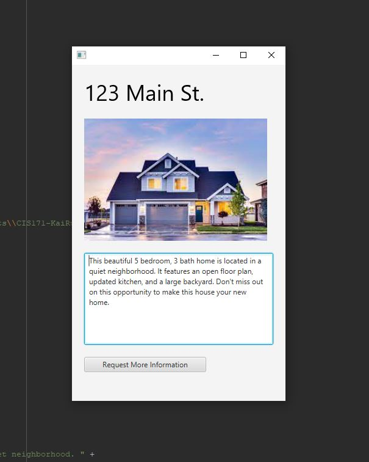

# Chapter 14 GUI Informational Display

One Paragraph of project description goes here

This project is an informational display created using the JavaFX API libraries. The display consists of an image, a text heading, a button, and a textbox. 
The image is used to display a picture of a property for sale, for example. The text heading displays the address of the property in a bold, larger font. 
The textbox is used to provide a description of the property and the button allows the user to request more information. 
The display is created using a VBox layout, which is a container that organizes nodes vertically. 
The scene is set to 350 by 550 pixels and the stage is shown to the user. 
The program runs a JavaFX application that displays the informational display to the user.

This image will display as your example output. Name the image README.JPG in your project folder.

The assignment requires you to create a GUI display that provides information using JavaFX API Libraries. 
The display should include at least an image, a text heading, a button, and a textbox. 
To analyze the requirements and develop a solution, I started by familiarizing myself with the JavaFX API library and got it installed.
I decided on the spacing and padding of my Vbox layout. Then created the image, text heading, button and text box. 

### Design

I used a single class to create the entire display. 
All the components of the display such as the image, text heading, button, and textbox were defined and added to the layout within the same class
This design approach is simple and straightforward, but not scalable.

### Testing

A step by step series of examples that you developed to properly test the program. 

I verified that the image is being displayed correctly and that the aspect ratio, height, and width are set correctly. Check that the image is not stretched or distorted.

Then I verified that the text heading is being displayed correctly and that the font size, text alignment, and color are set correctly.

I verified that the button is being displayed correctly and that the width is set correctly. I checked that the button label is set correctly.

I verified that the textbox is being displayed correctly and that the height, width, and wrap text property are set correctly. I checked that the text in the textbox is being displayed correctly.

I tested the program step by step to ensure that each component is working correctly before moving on to the next component. This helped me find and fix any issues early on in the testing process.

## Notes

I tried using an image link but it would not display properly. So instead I created an image file and downloaded an image. I was not aware I had to put the ENTIRE file path but luckily windows let me copy it to text and it worked flawlessly!

## Do not change content below this line
## Adapted from a README Built With

* [Dropwizard](http://www.dropwizard.io/1.0.2/docs/) - The web framework used
* [Maven](https://maven.apache.org/) - Dependency Management
* [ROME](https://rometools.github.io/rome/) - Used to generate RSS Feeds

## Contributing

Please read [CONTRIBUTING.md](https://gist.github.com/PurpleBooth/b24679402957c63ec426) for details on our code of conduct, and the process for submitting pull requests to us.

## Versioning

We use [SemVer](http://semver.org/) for versioning. For the versions available, see the [tags on this repository](https://github.com/your/project/tags). 

## Authors

* **Billie Thompson** - *Initial work* - [PurpleBooth](https://github.com/PurpleBooth)

See also the list of [contributors](https://github.com/your/project/contributors) who participated in this project.

## License

This project is licensed under the MIT License - see the [LICENSE.md](LICENSE.md) file for details

## Acknowledgments

* Hat tip to anyone who's code was used
* Inspiration
* etc
