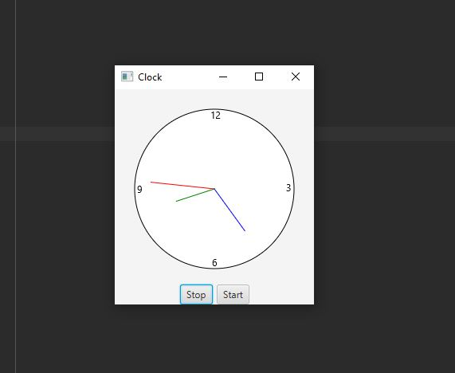

# Control Clock Exercise 15.32

Java program that creates a clock using JavaFX. 
The program defines a ClockPane class that extends a JavaFX Pane and includes methods for creating and animating the clock.
The main class, ControlClock, creates an instance of the ClockPane class and adds it to a JavaFX BorderPane along with buttons for starting and stopping the clock animation.

## Example Output

This image will display as your example output. Name the image README.JPG in your project folder.

## Analysis Steps

I needed to Modify ClockPane.java, to add animation to the class and a start() and stop() method.
I needed to identify the functionality required for the clock animation and start() and stop() methods.

### Design

I started by identifying the requirements of the project. In this case, the requirement is to design a clock that can be controlled by start and stop buttons.
Then I added the start and stop buttons and tested their functionality. Overall, the design of this project involves breaking down the clock into its individual components and then building the clock from these components.

### Testing

I tested the animation, verified that the second hand moves correctly. 
I set the time to an arbitrary value and verify that the minute and hour hands move correctly.
I tested a few boundary cases, such as setting the time to 0 or 23 for hours, 0 or 59 for minutes and seconds.
I ended by testing the btnStop and btnStart buttons, and verifying that the clock animation stops and starts when the corresponding button is clicked.

## Notes

No real trouble with this one just a lot of research that I needed to do.

## Do not change content below this line
## Adapted from a README Built With

* [Dropwizard](http://www.dropwizard.io/1.0.2/docs/) - The web framework used
* [Maven](https://maven.apache.org/) - Dependency Management
* [ROME](https://rometools.github.io/rome/) - Used to generate RSS Feeds

## Contributing

Please read [CONTRIBUTING.md](https://gist.github.com/PurpleBooth/b24679402957c63ec426) for details on our code of conduct, and the process for submitting pull requests to us.

## Versioning

We use [SemVer](http://semver.org/) for versioning. For the versions available, see the [tags on this repository](https://github.com/your/project/tags). 

## Authors

* **Billie Thompson** - *Initial work* - [PurpleBooth](https://github.com/PurpleBooth)

See also the list of [contributors](https://github.com/your/project/contributors) who participated in this project.

## License

This project is licensed under the MIT License - see the [LICENSE.md](LICENSE.md) file for details

## Acknowledgments

* Hat tip to anyone who's code was used
* Inspiration
* etc
