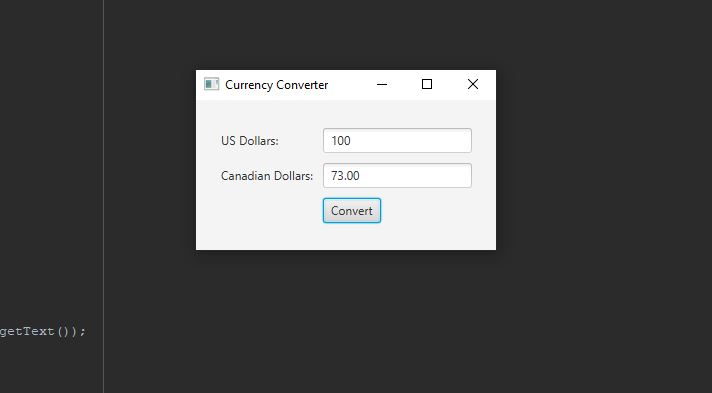

# Exam 2 Currency Converter

This program creates a window with two text fields and a button. The user enters an amount in the top text field, which represents US dollars.
When the Convert button is clicked, the program converts the US dollar amount to Canadian dollars and displays the result in the bottom text field. 
The conversion rate used is 1 USD = 0.73 CAD.

## Example Output

This image will display as your example output. Name the image README.JPG in your project folder.

## Analysis Steps

The requirements for the program were defined as allowing the user to input an amount in US dollars, performing the conversion to Canadian dollars using the conversion rate 1 USD = 0.73 CAD.

Based on the requirements, I determined that the program would need two text fields (one for the US dollar amount and one for the Canadian dollar amount), a label for each text field, and a button to perform the conversion.

The logic for the program involved retrieving the input amount from the US dollar text field, converting it to Canadian dollars using the conversion rate, and displaying the converted amount in the Canadian dollar text field.

### Design

I approached the design using a single class to define the necessary objects and implement the program's logic.

Two text fields for input and output of the dollar amounts

Two labels for each text field to display which currency is being input or output

A button to initiate the conversion process

A method to perform the conversion from USD to CAD and update the output text field with the converted amount

### Testing

A step by step series of examples that you developed to properly test the program. 

Enter a valid positive USD amount (e.g. 100) and click the "Convert" button. Verify that the converted CAD amount is displayed correctly in the output text field

Enter a negative USD amount (e.g. -20) and click the "Convert" button.

Enter an empty value in the USD amount text field and click the "Convert" button. Verify that an error message is displayed indicating that the input amount is required.

## Notes

No issues this was a fun project.

## Do not change content below this line
## Adapted from a README Built With

* [Dropwizard](http://www.dropwizard.io/1.0.2/docs/) - The web framework used
* [Maven](https://maven.apache.org/) - Dependency Management
* [ROME](https://rometools.github.io/rome/) - Used to generate RSS Feeds

## Contributing

Please read [CONTRIBUTING.md](https://gist.github.com/PurpleBooth/b24679402957c63ec426) for details on our code of conduct, and the process for submitting pull requests to us.

## Versioning

We use [SemVer](http://semver.org/) for versioning. For the versions available, see the [tags on this repository](https://github.com/your/project/tags). 

## Authors

* **Billie Thompson** - *Initial work* - [PurpleBooth](https://github.com/PurpleBooth)

See also the list of [contributors](https://github.com/your/project/contributors) who participated in this project.

## License

This project is licensed under the MIT License - see the [LICENSE.md](LICENSE.md) file for details

## Acknowledgments

* Hat tip to anyone who's code was used
* Inspiration
* etc
