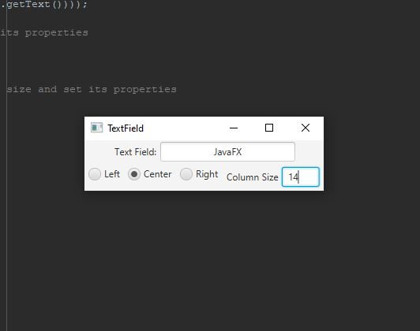

# Project Title

One Paragraph of project description goes here

This Java program creates a GUI with a text field that can be aligned to the left, center, or right, and allows the user to set the number of columns in the text field.

This image will display as your example output. Name the image README.JPG in your project folder.

## Analysis Steps

Write a program that sets the horizontal alignment and column-size properties of a text field dynamically, as shown in Figure 16.38a.

### Design

When designing this program, one might have started by identifying the main goal of the program,
which is to create a GUI with a text field that can be aligned in different ways and whose size can be adjusted.
Next, they would have chosen appropriate GUI components to use, such as a TextField, Labels, and RadioButtons, 
and then laid them out in a way that makes sense and is visually appealing, using a layout manager like GridPane.

### Testing

Click on the "Right" radio button. The text in the text field should align to the right.
Click on the "Left" radio button. The text in the text field should align to the left.
Click on the "Center" radio button. The text in the text field should center align.
Click on the "Column Size" text field and enter a new value, e.g. "8". Press Enter. The text field should resize to 8 columns.
Click on the "Column Size" text field and enter an invalid value, e.g. "hello".
Click on the "Column Size" text field and enter a negative value, e.g. "-5".

## Notes

No real issues with this program.

## Do not change content below this line
## Adapted from a README Built With

* [Dropwizard](http://www.dropwizard.io/1.0.2/docs/) - The web framework used
* [Maven](https://maven.apache.org/) - Dependency Management
* [ROME](https://rometools.github.io/rome/) - Used to generate RSS Feeds

## Contributing

Please read [CONTRIBUTING.md](https://gist.github.com/PurpleBooth/b24679402957c63ec426) for details on our code of conduct, and the process for submitting pull requests to us.

## Versioning

We use [SemVer](http://semver.org/) for versioning. For the versions available, see the [tags on this repository](https://github.com/your/project/tags). 

## Authors

* **Billie Thompson** - *Initial work* - [PurpleBooth](https://github.com/PurpleBooth)

See also the list of [contributors](https://github.com/your/project/contributors) who participated in this project.

## License

This project is licensed under the MIT License - see the [LICENSE.md](LICENSE.md) file for details

## Acknowledgments

* Hat tip to anyone who's code was used
* Inspiration
* etc
