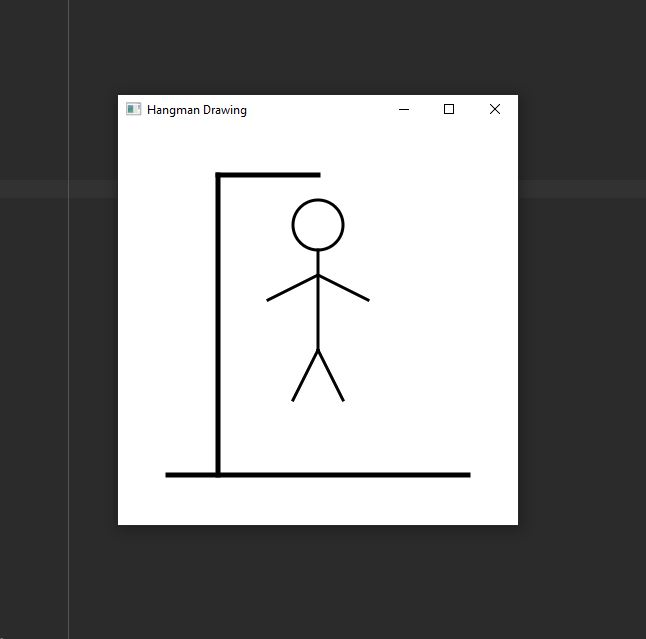

# Hangman Drawing

 The project is a JavaFX program that displays a drawing for the Hangman game. 
 The program creates a canvas and uses the GraphicsContext class to draw a scaffold and a stick figure representing the Hangman.

## Example Output

This image will display as your example output. Name the image README.JPG in your project folder.

## Analysis Steps

Firstly, I created a GUI using JavaFX. This involved creating a window, a canvas for the drawing, and other UI elements as needed.
Then I designed the hangman drawing it self which involed creating the scaffold and the stick figure.

### Design

I identified the components needed for the program, a window to display the drawing, a canvas to draw on, a GraphicsContext to draw with, and UI elements to allow the program to run.

### Testing

I verified that the GUI elements are displaying correctly and that the user can interact with the UI as expected.

Then I tested the drawing, verifying that the hangman drawing is displaying correctly on the canvas. I tested the different parts of the drawing to ensure that they are being added in the correct order and that they are being displayed correctly.

## Notes

Using GraphicsContext took some getting used to in the beginning.

## Do not change content below this line
## Adapted from a README Built With

* [Dropwizard](http://www.dropwizard.io/1.0.2/docs/) - The web framework used
* [Maven](https://maven.apache.org/) - Dependency Management
* [ROME](https://rometools.github.io/rome/) - Used to generate RSS Feeds

## Contributing

Please read [CONTRIBUTING.md](https://gist.github.com/PurpleBooth/b24679402957c63ec426) for details on our code of conduct, and the process for submitting pull requests to us.

## Versioning

We use [SemVer](http://semver.org/) for versioning. For the versions available, see the [tags on this repository](https://github.com/your/project/tags). 

## Authors

* **Billie Thompson** - *Initial work* - [PurpleBooth](https://github.com/PurpleBooth)

See also the list of [contributors](https://github.com/your/project/contributors) who participated in this project.

## License

This project is licensed under the MIT License - see the [LICENSE.md](LICENSE.md) file for details

## Acknowledgments

* Hat tip to anyone who's code was used
* Inspiration
* etc
