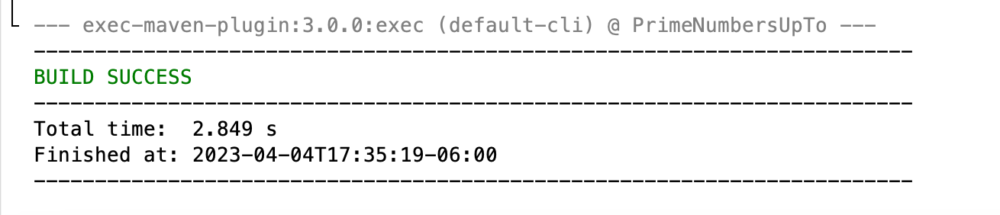

# Exercise 22.8 All prime numbers up to

The goal of this project is to create a Java program that generates prime numbers up to 1,000,000 and stores them in a binary data file called
"PrimeNumbers.dat". The program will read existing prime numbers from the file and continue searching for new prime numbers until it reaches the
limit. The program uses an array of size 10,000 to store the prime numbers read from the file, and if no divisor is found, it will append the new
prime number to the file and reset the array to start storing new prime numbers. This program ensures that if the machine is shut down and rebooted
it can resume generating prime numbers from where it left off by using the prime numbers stored in the binary data file.

## Example Output

This image will display as your example output. Name the image README.jpg in your project folder.

## Analysis Steps

I first needed to understand the algorithm for finding prime numbers. 
I then studied the requirement to store the prime numbers in a binary data file, read them from the file, and check if the new number is prime. 
I identified that a long type array was suitable for storing the prime numbers and that I could use a DataInputStream and DataOutputStream class to read and write the binary data file. 
To ensure the program could resume running after the machine is shut down, I had to handle the end of the file and start the program from the last prime number stored in the file.
I also had to make sure that the program continued reading from the file until a divisor is found or all the numbers in the file are read.

### Design

The design of the program would typically involve creating a loop that iterates through the numbers from 2 to the upper limit of prime numbers to be generated 
(1,000,000 in this case), and for each number, checking if it is a prime number.

### Testing

Run the program for the first time, with no existing PrimeNumbers.dat file.

Change the upper limit to a smaller number, such as 100,000, and run the program.

Run the program multiple times and compare the output to ensure that the program is generating the same set of prime numbers every time.

## Notes

Explain any issues or testing instructions.

## Do not change content below this line
## Adapted from a README Built With

* [Dropwizard](http://www.dropwizard.io/1.0.2/docs/) - The web framework used
* [Maven](https://maven.apache.org/) - Dependency Management
* [ROME](https://rometools.github.io/rome/) - Used to generate RSS Feeds

## Contributing

Please read [CONTRIBUTING.md](https://gist.github.com/PurpleBooth/b24679402957c63ec426) for details on our code of conduct, and the process for submitting pull requests to us.

## Versioning

We use [SemVer](http://semver.org/) for versioning. For the versions available, see the [tags on this repository](https://github.com/your/project/tags). 

## Authors

* **Billie Thompson** - *Initial work* - [PurpleBooth](https://github.com/PurpleBooth)

See also the list of [contributors](https://github.com/your/project/contributors) who participated in this project.

## License

This project is licensed under the MIT License - see the [LICENSE.md](LICENSE.md) file for details

## Acknowledgments

* Hat tip to anyone who's code was used
* Inspiration
* etc
