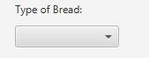
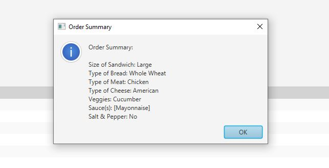

#Subway Order System User's Guide

##Getting Started

The Subway Order System is a simple GUI application that lets you create your custom Subway order.

When you first open the application, you will see a variety of options displayed in a single window.

#Size of Sandwich
At the top of the window, you will see a dropdown menu labeled "Size of Sandwich". Click on this dropdown to see the available options: Small, Medium, and Large. Select the size you want by clicking on it.

#Type of Bread
Below the sandwich size, there's another dropdown menu labeled "Type of Bread". Click on this dropdown to see the available options. Select the type of bread you want by clicking on it.

#Type of Meat
Next, you will see a dropdown menu labeled "Type of Meat". Click on this dropdown to see the available options. Select the type of meat you want by clicking on it.

#Type of Cheese
Below the meat type, there's a dropdown menu labeled "Type of Cheese". Click on this dropdown to see the available options. Select the type of cheese you want by clicking on it.

#Select Veggies
Next, you will see several checkboxes under the label "Select up to three veggies". Click on the checkboxes to select your preferred veggies. You can select up to three.

#Select Sauce(s)
Below the veggies selection, there's a list labeled "Select Sauce(s)". You can select one or multiple sauces from this list. To select, click on the desired sauce.

#Add Salt & Pepper
Next, you will see two options under the label "Add Salt & Pepper?". You can select "Yes" or "No" by clicking on the respective radio button.

#Place Your Order
Once you've made all your selections, click on the "Order" button at the bottom of the window.

#Review Your Order
After you click the "Order" button, a window will pop up displaying a summary of your order. Review your order to ensure that everything is correct.

#Exit the Application
To exit the application, simply close the window by clicking on the "X" in the top-right corner.

